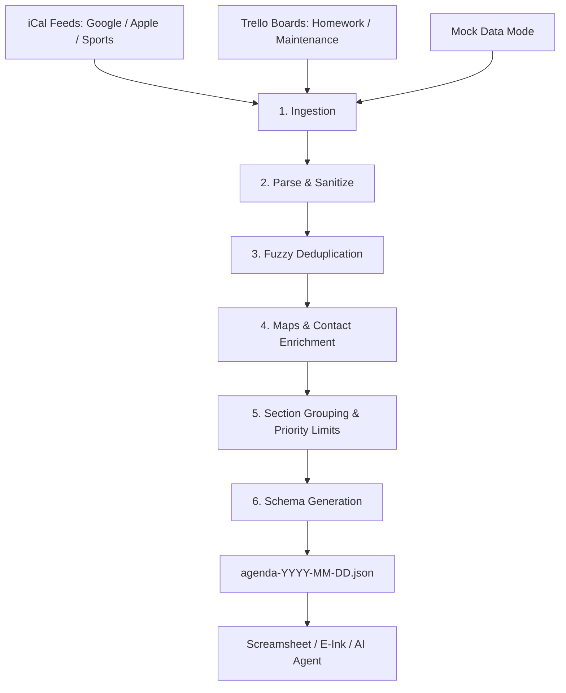

# Daily Agenda Aggregator

[](https://nodejs.org/)
[](https://www.typescriptlang.org/)
[](LICENSE)

A CLI utility designed to scrape, aggregate, deduplicate, and normalize daily schedules and tasks from multiple digital sources (**iCal Feeds**, **Google Calendar**, **Trello Boards**) into a structured, single-day JSON artifact (`agenda-YYYY-MM-DD.json`).

This JSON artifact is purpose-built for consumption by **daily briefings**, **screamsheets**, **e-ink dashboards**, **automated print pipelines**, and **downstream AI agents**.

---

## 🚀 Quick Start

### 1. Installation
```bash
git clone git@github.com:peterjmartinson/random-task.git
cd random-task
npm install
```

### 2. Run with Mock Data (Offline Dry-Run)
```bash
npx tsx src/cli.ts --mock --dry-run
```

### 3. Run with Live Configuration
```bash
# Generate today's agenda into the configured output_directory
npx tsx src/cli.ts

# Generate agenda for a specific target date
npx tsx src/cli.ts --date 2026-08-28

# Output JSON directly to stdout without writing to disk
npx tsx src/cli.ts --dry-run
```

---

## ⚙️ Input Specification: `config.json`

The application reads `config.json` at the project root (or via `--config <path>`).

### Example Configuration
```json
{
  "max_tasks": 5,
  "output_directory": "./output",
  "default_start_location": "1041 Reese Ave., Bryn Mawr, PA 19010",
  "calendars": {
    "ical_urls": [
      {
        "name": "Personal",
        "url": "https://calendar.google.com/calendar/ical/user%40gmail.com/private-xxxx/basic.ics"
      },
      {
        "name": "Family",
        "url": "https://calendar.google.com/calendar/ical/family%40group.calendar.google.com/private-xxxx/basic.ics"
      },
      "https://s3-us-west-2.amazonaws.com/cdn-app.teamlinkt.com/ical/events/subscribe/sports-feed.ics"
    ]
  },
  "trello": {
    "api_key": "YOUR_TRELLO_API_KEY",
    "token": "YOUR_TRELLO_USER_TOKEN",
    "boards": [
      {
        "name": "Homework",
        "board_id": "6a0dd7e64e205c4e01db1b21",
        "lists": [
          "6a0dd7fc14b166b8906b1202",
          "6a0dd8027d3bffa03d62e7c4"
        ],
        "max_tasks": 5,
        "labels": {
          "Isaac": {
            "label_id": "6a0dd7e769a7a10ca5f5ced0",
            "cover_color": "blue"
          },
          "Asher": {
            "label_id": "6a0dd7e67d3bffa03d62a17a",
            "cover_color": "green"
          }
        }
      },
      {
        "name": "Home Maintenance",
        "board_id": "YOUR_MAINTENANCE_BOARD_ID",
        "lists": [
          "YOUR_TODO_LIST_ID"
        ]
      }
    ],
    "include_past_due": true
  },
  "maps": {
    "enabled": true,
    "api_key": "YOUR_GOOGLE_MAPS_API_KEY"
  }
}
```

### Input Field Reference

| Field | Type | Description |
| :--- | :--- | :--- |
| `max_tasks` | `number` | Global maximum number of tasks per section (default: `5`). |
| `output_directory` | `string` | Target folder for `agenda-YYYY-MM-DD.json` files (default: `./output`). |
| `default_start_location` | `string` | Base origin address used by Maps API for drive-time calculations. |
| `calendars.ical_urls` | `Array<string \| object>` | List of `.ics` subscription URLs (Google Calendar secret iCal, Apple Calendar, TeamLinkt, TeamSnap, etc.). Can be string URLs or `{ name, url }` objects. |
| `trello.api_key` | `string` | Trello Developer API Key. |
| `trello.token` | `string` | Trello Member Read Token. |
| `trello.include_past_due` | `boolean` | When `true`, automatically queries and surfaces open overdue cards across the board. |
| `trello.boards` | `Array<object>` | Trello boards to aggregate into named task sections. |
| `trello.boards[].name` | `string` | Section header title for the board (e.g. `"Homework"`, `"Home Maintenance"`). |
| `trello.boards[].board_id` | `string` | Trello 24-character hex Board ID. |
| `trello.boards[].lists` | `string[]` | List IDs within the board to pull cards from (e.g. "Today", "To Do"). |
| `trello.boards[].max_tasks` | `number` *(optional)* | Override task limit specifically for this board. |
| `trello.boards[].labels` | `Record<string, object>` *(optional)* | Metadata mapping dictionary. Maps `label_id`, `cover_color`, or label name to an `assignee` (e.g. `"Isaac"`, `"Asher"`). |
| `maps.enabled` | `boolean` | Set `true` to enable Google Maps Distance Matrix drive-time enrichment. |
| `maps.api_key` | `string` | Google Maps API Key with Distance Matrix API enabled. |

---

## 📜 Output Specification: `agenda-YYYY-MM-DD.json`

The CLI emits a clean, validated JSON artifact structured specifically for daily screamsheets and automated layout generators.

### Output Schema Definition

```typescript
export interface AgendaOutput {
  date: string;                      // Target date in YYYY-MM-DD format
  metadata: AgendaOutputMetadata;    // Execution timestamp and counts
  agenda: AgendaEventOutput[];       // Chronologically sorted events
  sections: AgendaSectionOutput[];   // Categorized task sections
}

export interface AgendaOutputMetadata {
  generated_at: string;              // ISO 8601 generation timestamp
  total_events: number;              // Total number of events for the day
  total_tasks: number;               // Total number of tasks across all sections
}

export interface AgendaEventOutput {
  id: string;                        // Unique identifier (e.g. "ical-<uid>-<timestamp>")
  type: "event";                     // Constant item type discriminator
  title: string;                     // Event summary / title
  time: string;                      // Formatted time range e.g. "09:30 AM - 10:00 AM" or "All Day"
  url?: string;                      // Meeting link or calendar URL
  accessory?: string;                // Enriched context (e.g. "Address: ... (15 min drive time. Leave by 09:15 AM)")
}

export interface AgendaSectionOutput {
  title: string;                     // Section header (e.g. "Homework", "Home Maintenance")
  tasks: AgendaTaskOutput[];         // Prioritized tasks belonging to this section
}

export interface AgendaTaskOutput {
  id: string;                        // Unique identifier (e.g. "trello-<card_id>")
  title: string;                     // Task / Card title
  priority: "high" | "medium" | "low"; // Priority level
  url?: string;                      // Direct link to the task (e.g. Trello card shortUrl)
  assignee?: string;                 // Mapped person / assignee (e.g. "Isaac", "Asher")
  due?: string;                      // ISO 8601 due date if present
  labels?: TaskLabelOutput[];        // Extracted labels [{ id, name, color }]
  cover_color?: string;              // Trello card cover color (e.g. "blue", "green")
  subtasks?: string[];               // Incomplete checklist items
  accessory?: string;                // Urgent accessory indicator (e.g. "PAST DUE")
}

export interface TaskLabelOutput {
  id?: string;
  name?: string;
  color?: string;
}
```

### Sample Output Payload
```json
{
  "date": "2026-08-28",
  "metadata": {
    "generated_at": "2026-08-28T02:41:32.093Z",
    "total_events": 3,
    "total_tasks": 4
  },
  "agenda": [
    {
      "id": "ical-standup-001@google.com-2026-08-28T13:30:00.000Z",
      "type": "event",
      "title": "Work stand up",
      "time": "09:30 AM - 10:00 AM",
      "url": "https://meet.google.com/abc-defg-hij"
    },
    {
      "id": "ical-service-002@google.com",
      "type": "event",
      "title": "Toyota service",
      "time": "10:30 AM - 11:30 AM",
      "accessory": "Address: 123 Main St, Conshohocken, PA (18 min drive time. Leave by 10:12 AM)"
    },
    {
      "id": "ical-soccer-003@teamlinkt.com",
      "type": "event",
      "title": "Geckos Soccer Practice",
      "time": "05:00 PM - 06:30 PM",
      "accessory": "Address: Polo Field #2"
    }
  ],
  "sections": [
    {
      "title": "Homework",
      "tasks": [
        {
          "id": "trello-6a39c1839ee76132e8214168",
          "title": "[BAO 5:3] Multi-Step Equations 1",
          "priority": "medium",
          "url": "https://trello.com/c/NFwutUga",
          "assignee": "Isaac",
          "labels": [
            { "id": "6a0dd7e769a7a10ca5f5ced0", "name": "Isaac", "color": "blue" }
          ],
          "cover_color": "blue"
        },
        {
          "id": "trello-6a39c6185b2354d5e53c6f8b",
          "title": "[Math] Kangaroo 2015 (Pages 1-2)",
          "priority": "medium",
          "url": "https://trello.com/c/k8AFdBdO",
          "assignee": "Asher",
          "labels": [
            { "id": "6a0dd7e67d3bffa03d62a17a", "name": "Asher", "color": "green" }
          ],
          "cover_color": "green"
        }
      ]
    },
    {
      "title": "Home Maintenance",
      "tasks": [
        {
          "id": "trello-maint-01",
          "title": "Replace furnace humidifier filter",
          "priority": "high",
          "url": "https://trello.com/c/maint1",
          "accessory": "PAST DUE",
          "subtasks": [
            "Order 16x25x1 filter from store",
            "Turn off furnace power before swap"
          ]
        }
      ]
    }
  ]
}
```

---

## 🤖 Screamsheet & Downstream Consumer Guide

When writing downstream agents, printers, or UI components to render this data, follow these guidelines:

1. **Timeline Presentation (`agenda`)**:
   - Items are pre-sorted in chronological order.
   - Use `item.time` directly for display headers.
   - Check `item.accessory` for travel directions, drive time alerts, or "Leave by" timestamps.
2. **Sectioned Task Groups (`sections`)**:
   - Iterate over `sections` array to render each board under its own header (`section.title`).
   - Use `task.assignee` (or `task.cover_color`) to badge or filter tasks per person (e.g. Isaac vs. Asher).
   - Highlight any tasks where `task.accessory === "PAST DUE"`.
   - Render `task.subtasks` as checkable items under the task.
3. **Filtering & Omission**:
   - If a screamsheet only targets a single person or category, simply filter `sections` by `title` or tasks by `assignee`.

---

## 🛠️ Processing Pipeline Architecture



1. **Ingestion ([`01-ingest.ts`](src/pipeline/01-ingest.ts))**: Queries all active source adapters (`ICalAdapter`, `TrelloAdapter`, `MockAdapter`).
2. **Parsing ([`02-parse.ts`](src/pipeline/02-parse.ts))**: Unifies source items into standard models, expanding recurring iCal rules (`RRULE`) and parsing Trello checklists.
3. **Fuzzy Deduplication ([`03-dedupe.ts`](src/pipeline/03-dedupe.ts))**: Merges overlapping events and cross-linked items between calendar descriptions and Trello cards.
4. **Enrichment ([`04-enrich.ts`](src/pipeline/04-enrich.ts))**: Computes drive times using Google Maps Distance Matrix and parses phone/email contacts.
5. **Prioritization & Limits ([`05-prioritize.ts`](src/pipeline/05-prioritize.ts))**: Groups tasks into board sections, prioritizing overdue tasks and high-priority labels, capping per-section task limits.
6. **Formatting ([`06-format.ts`](src/pipeline/06-format.ts))**: Emits the final spec-compliant `AgendaOutput` JSON artifact.

---

## 🖥️ CLI Options Reference

```bash
agenda-aggregator [options]
```

| Option | Flag | Description | Default |
| :--- | :--- | :--- | :--- |
| `--config <path>` | `-c` | Path to custom `config.json` | `config.json` |
| `--date <YYYY-MM-DD>` | `-d` | Target date to aggregate | Today's Date |
| `--output-dir <path>` | `-o` | Output directory for JSON file | From `config.json` |
| `--mock` | `-m` | Run offline with mock data adapters | `false` |
| `--dry-run` | | Output JSON to stdout without writing to disk | `false` |
| `--help` | `-h` | Show help information | |

---

## 🧪 Testing & Verification

```bash
# Run unit & integration test suites
npm test

# Build TypeScript to dist/
npm run build
```

---

## 📄 License

[MIT](LICENSE) © Peter Martinson
