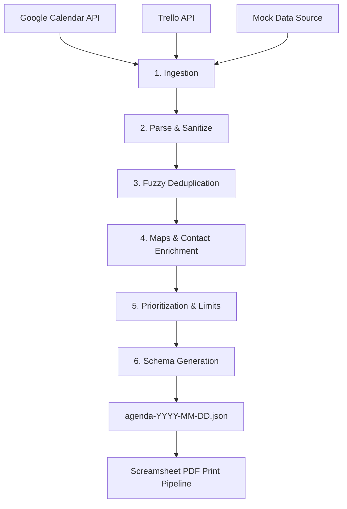

# Screamsheet Morning Aggregator

[](https://nodejs.org/)
[](https://www.typescriptlang.org/)
[](LICENSE)

A CLI utility designed to scrape, aggregate, deduplicate, and normalize daily schedules and task items from multiple digital sources (**Google Calendar**, **Trello**, etc.) into a unified daily agenda JSON output (`agenda-YYYY-MM-DD.json`).

This output file is fed directly into the **Screamsheet** printing pipeline, which renders and physically prints your daily briefing every morning.

---

## 🚀 Quick Start (Mock Mode)

You can run the aggregator immediately without setting up any API keys by using the built-in `--mock` mode:

```bash
# Clone the repository
git clone git@github.com:peterjmartinson/random-task.git
cd random-task

# Install dependencies
npm install

# Run in offline mock mode (outputs JSON directly to terminal)
npx tsx src/cli.ts --mock --dry-run
```

---

## ✨ Features

* 📅 **Google Calendar Ingestion**: Pulls today's scheduled events across multiple primary and shared calendars.
* 📋 **Trello Board Syncing**: Scrapes target lists, open tasks, checklists, and surfaces past-due cards.
* 🔍 **Smart Fuzzy Deduplication**: Merges overlapping events and tasks by title similarity and cross-linked URLs (e.g. Trello card links inside Google Calendar descriptions).
* 🚗 **Maps & Drive Time Enrichment**: Calculates travel duration using Google Maps Distance Matrix API, tracks starting base location shifts (`Start: Office`), and computes "Leave by" timestamps.
* 📞 **Contact Info Extraction**: Automatically extracts phone numbers and email addresses from descriptions and locations into item accessories.
* 🎯 **Prioritization & Task Limits**: Ranks tasks by priority (`high` > `medium` > `low`), surfaces past-due items first, and caps total tasks to your configured `max_tasks` limit.
* 📜 **Spec-Compliant JSON Output**: Emits clean `agenda-YYYY-MM-DD.json` ready for consumption by Screamsheet or downstream tools.

---

## 🛠️ Architecture & Pipeline



---

## ⚙️ Configuration & Credentials

The aggregator reads `config.json` at startup. Copy `config.json.example` to `config.json` to get started:

```bash
cp config.json.example config.json
```

### Sample `config.json`
```json
{
  "max_tasks": 5,
  "output_directory": "C:/Users/Admin/Documents/screamsheet/incoming",
  "default_start_location": "123 Home St, Anytown, USA",
  "google_calendar": {
    "api_key": "YOUR_GOOGLE_CALENDAR_API_KEY",
    "calendar_ids": ["primary"]
  },
  "trello": {
    "api_key": "YOUR_TRELLO_API_KEY",
    "token": "YOUR_TRELLO_USER_TOKEN",
    "boards": [
      {
        "board_id": "YOUR_BOARD_ID",
        "lists": ["YOUR_LIST_ID_TODAY"]
      }
    ],
    "include_past_due": true
  },
  "maps": {
    "enabled": true,
    "api_key": "YOUR_GOOGLE_MAPS_API_KEY"
  }
}
```

> 📖 **Need help gathering API keys, tokens, or Board/List IDs?**  
> Check out the step-by-step guide in [docs/setup-guide.md](docs/setup-guide.md).

---

## 🖥️ CLI Usage

```bash
screamsheet-aggregator [options]
```

### Options

| Flag | Long Flag | Description | Default |
| :--- | :--- | :--- | :--- |
| `-c` | `--config <path>` | Path to custom `config.json` file | `config.json` |
| `-d` | `--date <YYYY-MM-DD>` | Target date for agenda aggregation | Today's Date |
| `-o` | `--output-dir <path>` | Override output directory for JSON file | From `config.json` |
| `-m` | `--mock` | Run offline with mock data adapters | `false` |
| | `--dry-run` | Output JSON string to stdout without writing to disk | `false` |
| `-h` | `--help` | Display help information | |

### Examples

```bash
# Generate today's agenda file to configured output_directory
npx tsx src/cli.ts

# Generate agenda for a specific past/future date
npx tsx src/cli.ts --date 2026-08-15

# Dry run with custom config file
npx tsx src/cli.ts --config ./my-config.json --dry-run
```

---

## 🧪 Testing & Development

```bash
# Run unit & integration test suites
npm test

# Build TypeScript to dist/
npm run build
```

---

## 📄 License

[MIT](LICENSE) © Peter Martinson
