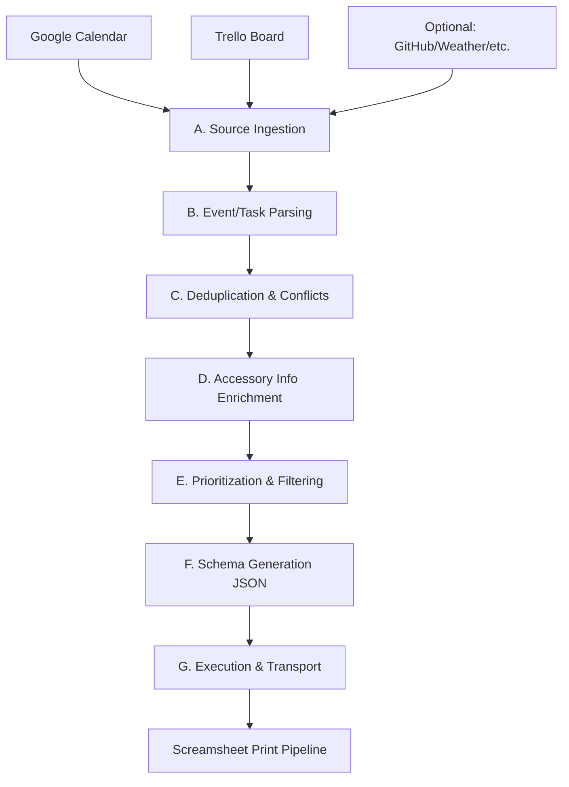

# Screamsheet Morning Aggregator: Specification

## 1. Overview
The **Screamsheet Morning Aggregator** is a CLI utility or background service designed to scrape, aggregate, and normalize daily schedules, tasks, and contextual updates from multiple digital sources. 

Its primary objective is to produce a single, highly structured, unified **"Daily Agenda" file (JSON)**. This output file is consumed by the **Screamsheet Project**, which formats and physically prints the agenda every morning.



---

## 2. Aggregator Configuration

To control behavior dynamically without changing the code, a configuration file (`config.json`) will be read at startup.

### Configuration Schema (`config.json`)
```json
{
  "max_tasks": 5,
  "output_directory": "C:/Users/Admin/Documents/screamsheet/incoming",
  "default_start_location": "123 Home St, Anytown, USA",
  "google_calendar": {
    "calendar_ids": ["primary", "family"]
  },
  "trello": {
    "boards": [
      {
        "board_id": "board_1_uuid",
        "lists": ["list_today_uuid", "list_in_progress_uuid"]
      },
      {
        "board_id": "board_2_uuid",
        "lists": ["list_urgent_uuid"]
      }
    ],
    "include_past_due": true
  },
  "maps": {
    "enabled": true,
    "api_key": "YOUR_GOOGLE_MAPS_API_KEY"
  }
}
```

---

## 3. Aggregator Pipeline (A to G Scaffold)

### A. Source Ingestion
The aggregator connects to external APIs and retrieves raw data payloads.
*   **Google Calendar API**:
    *   Auth: OAuth2 or Service Account.
    *   Scope: `events.list`.
    *   Query parameters: Retrieve events starting from `today at 00:00:00` to `today at 23:59:59` (in the local timezone).
*   **Trello API**:
    *   Auth: Developer API Key + User Token.
    *   Scope: Read-only.
    *   Target: Retrieve cards from configured boards and lists, plus any cards across those boards with a due date in the past (`include_past_due: true`).

### B. Event & Task Parsing
Raw responses from APIs are translated into a standardized internal format. We explicitly include a `url` field for link handling.
*   **Target Unified Model (Internal)**:
    ```typescript
    interface UnifiedItem {
      id: string;          // Source-specific UUID
      source: string;      // 'google_calendar', 'trello', etc.
      type: 'event' | 'task' | 'alert' | 'info';
      title: string;
      url?: string;        // Explicit digital resource link (Zoom, Meet, Trello Card URL)
      timeWindow?: {
        start: string;     // ISO 8601
        end: string;       // ISO 8601
        allDay: boolean;
      };
      priority: 'high' | 'medium' | 'low';
      status: 'pending' | 'in_progress' | 'done';
      description?: string;
      subtasks?: string[]; // Checklist items
      metadata: {
        location?: string;
        drive_time_mins?: number;
        phone?: string;
        [key: string]: any;
      };
    }
    ```

### C. Deduplication & Conflict Resolution
*   **Matching Rules**: Match items by similar titles (fuzzy matching) or cross-linked URLs (e.g., Trello card link in the Google Calendar event description).
*   **Deduplication Strategy**: Merge them into a single item, setting the type to `event` (since it has a fixed time) but preserving the checklist/subtasks and original URL from Trello.

### D. Accessory Info Enrichment
*   **Drive Time (Maps Integration)**:
    *   For calendar events with a physical location:
        1.  Determine **departure location**:
            *   For the first event of the day: Use `default_start_location` from `config.json`.
            *   For subsequent events: Use the location of the *previous* calendar event of the day.
            *   *Override Rule*: If a calendar event starts with `Start:` or `Base:` (e.g., "Start: Work Office"), update the active base location for subsequent calculations.
        2.  Fetch travel duration using Google Maps Distance Matrix API (or similar) using the departure time.
        3.  Populate `metadata.drive_time_mins` and format the departure time reminder (e.g., "Leave by 09:42 AM").
*   **People & Contacts**: Parse descriptions/attendees to append phone numbers or email addresses.

### E. Prioritization & Filtering
*   **Time Filtering**: Filter out events/tasks that are not active today.
*   **Limit Constraint**: Limit the total tasks emitted to the output file to the value of `max_tasks` configured in `config.json` (defaults to `5`).
*   **Priority Ranking**: Sort tasks by priority (high/medium/low) and due date (past due first).

### F. Output Schema Generation (JSON)
The output format is **JSON**.
```json
{
  "date": "2026-08-12",
  "metadata": {
    "generated_at": "2026-08-12T06:00:00-04:00"
  },
  "agenda": [
    {
      "id": "evt-001",
      "type": "event",
      "title": "Project Sync w/ Sarah",
      "time": "10:00 AM - 10:45 AM",
      "url": "https://meet.google.com/abc-defg-hij",
      "accessory": "Phone: (555) 012-3456"
    },
    {
      "id": "evt-002",
      "type": "event",
      "title": "Dentist Appointment",
      "time": "2:30 PM - 3:30 PM",
      "accessory": "Address: 104 Main St (15 min drive time. Leave by 02:15 PM)"
    }
  ],
  "tasks": [
    {
      "id": "tsk-101",
      "title": "Review pull requests for screamsheet repository",
      "priority": "high",
      "url": "https://trello.com/c/card-uuid-1",
      "subtasks": [
        "Approve PR #45",
        "Merge hotfix/auth-leak"
      ]
    },
    {
      "id": "tsk-102",
      "title": "Draft weekly project budget",
      "priority": "medium",
      "url": "https://trello.com/c/card-uuid-2",
      "accessory": "PAST DUE"
    }
  ]
}
```

### G. Execution & Transport
*   **Trigger**: A daily cron job runs at `05:30 AM` local time.
*   **File Naming**: Output a JSON file named `agenda-YYYY-MM-DD.json` (e.g., `agenda-2026-08-12.json`).
*   **Transport Flow**:
    1.  The aggregator writes the file to the configured `output_directory` (a folder monitored by Screamsheet).
    2.  Screamsheet reads the file in the morning to render and print.
    3.  Once processed/printed, Screamsheet moves the file into a `processed` subfolder (e.g., `C:/Users/Admin/Documents/screamsheet/incoming/processed/`).
